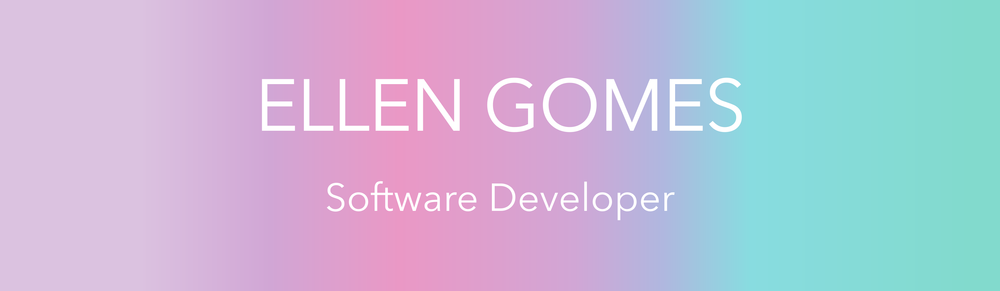

<!-- </img> -->

<h2>  ABOUT ME </h2>
 

Hi there! 👋
 
 
I'm Ellen, a research fanatic, analytical creative and passionately curious Brazilian and this is my journey from physical therapy to software development
 
:open_book:    Currently learning **JavaScript**, **React**, **Node** and **System architecture**, and passionate about Science, Design and Innovation.

:female_sign:    Pronouns:  She/Her

 

 
  

 

| MY TOP LANGUAGES  | STATS |
| :------------- | :------------- |
|  |  |

